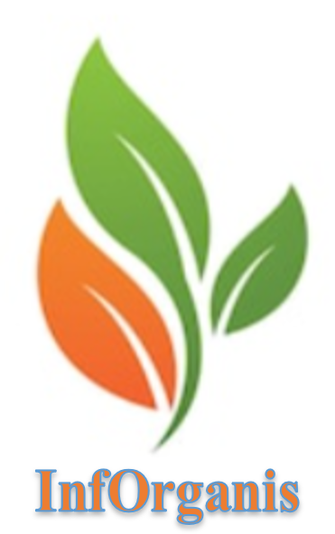

# Produtos orgânicos por Região

### ANÁLISE E DESENVOLVIMENTO DE SISTEMAS

#### Desenvolvimento de Aplicação Web Front-End ####

#### 1º Semestre/2022 ####

  

O presente projeto busca desenvolver um website com informações frequentemente atualizadas sobre os principais produtos orgânicos alimentícios produzidos em determinadas regiões.  Além disso, este website incluirá informações detalhadas sobre agricultura orgânica, agroecologia e sobre os problemas causados por uso de agrotóxicos.   

## Integrantes

* Caio César Ferreira Florindo
* Hebert Paixão do Nascimento
* Hélio Vieira Bernardes
* Leticia Layane Pauli

## Orientador

* Joyce Cristina de Paiva

# Documentação do projeto 

<ol>
<li><a href="docs/01-Documentação de Contexto.md"> Documentação de Contexto</a></li>
<li><a href="docs/02-Especificação do Projeto.md"> Especificação do Projeto</a></li>
<li><a href="docs/03-Metodologia.md"> Metodologia</a></li>
<li><a href="docs/04-Projeto de Interface.md"> Projeto de Interface</a></li>
<li><a href="docs/05-Arquitetura da Solução.md"> Arquitetura da Solução</a></li>
<li><a href="docs/06-Template padrão do Site.md"> Template padrão do Site</a></li>
<li><a href="docs/07-Programação de Funcionalidades.md"> Programação de Funcionalidades</a></li>
<li><a href="docs/08-Plano de Testes de Software.md"> Plano de Testes de Software</a></li>
<li><a href="docs/09-Registro de Testes de Software.md"> Registro de Testes de Software</a></li>
<li><a href="docs/10-Apresentação do Projeto.md"> Apresentação do Projeto</a></li>
<li><a href="docs/11-Referências.md"> Referências</a></li>
</ol>

# Hospedagem

* https://icei-puc-minas-pmv-ads.github.io/pmv-ads-2022-2-e1-proj-web-t1-organicos/src/).

# Armazenamento do Código-Fonte

* <a href="src/README.md">Código Fonte</a>

# Armazenamento da Apresentação

* <a href="presentation/README.md">Apresentação da solução</a>
