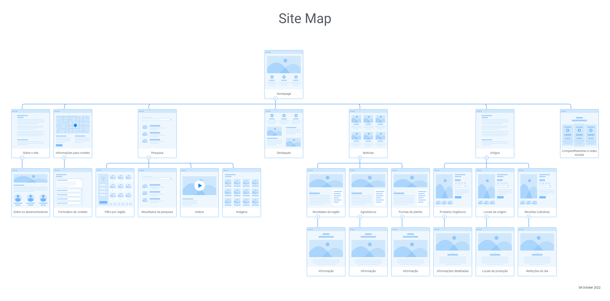

# Projeto de Interface

Pré-requisitos: <a href="2-Especificação do Projeto.md"> Documentação de Especificação</a>

O projeto tem uma identidade visual padronizada em todas as telas que são projetadas para o melhor funcionamento em desktops e dispositivos moveis. Para a elaboração do fluxo do usuário e do site map utilizou-se a ferramenta FlowMap, disponível no endereço: https://app.flowmapp.com/projects/

## Fluxo do usuário

Fluxo de usuário (User Flow) é uma técnica que permite ao desenvolvedor mapear todo fluxo de telas do site ou app. Essa técnica funciona para alinhar os caminhos e as possíveis ações que o usuário pode fazer junto com os membros de sua equipe. Na figura abaixo é exibido o fluxo do usuário proposto para os usuários do site sobre produtos orgânicos.

> **Links que foram consultados**:
> - [User Flow: O Quê É e Como Fazer?](https://medium.com/7bits/fluxo-de-usu%C3%A1rio-user-flow-o-que-%C3%A9-como-fazer-79d965872534)
> - [User Flow vs Site Maps](http://designr.com.br/sitemap-e-user-flow-quais-as-diferencas-e-quando-usar-cada-um/)
> - [Top 25 User Flow Tools & Templates for Smooth](https://www.mockplus.com/blog/post/user-flow-tools)

## Site Map

Também foi proposto site map conforme está na figura abaixo?

## Wireframes
Os wireframes são protótipos usados em design de interface para sugerir a estrutura de um site web e seu relacionamentos entre suas páginas. Para o desenvolvimento dos wireframes (prótotipos de média fidelidade) utilizou-se o InvisionApp (https://www.invisionapp.com/). 

Neste trabalho utilizamos protótipos de média fidelidade (wireframes), pois o foco é apenas validar a arquitetura da informação e a interatividade com os elementos da interface. Um wireframe web é uma ilustração semelhante do layout de elementos fundamentais na interface. 

De acordo com o fluxo de telas do projeto, apresentado anteriormente, as telas do sistema apresentam em detalhes nos itens que abaixo, tendo uma estrutura dividida em 4 grandes blocos, sendo eles:

- Cabeçalho: local onde são dispostos elementos fixos de identidade (logo) e navegação principal do site (menu da aplicação); 
- Conteúdo: apresenta o conteúdo da tela em questão; 
- Barra lateral: apresenta os elementos de navegação secundária, geralmente associados aos elementos do bloco de conteúdo;
- Rodapé: Contém informações sobre o autor da seção de dados, direitos autorais ou links para documentos relacionados.

Nas figuras abaixo são apresentados os principais wireframes (não todos) baseados no fluxo do usuário e site map desenvolvidos nesta seção. 

**Figura 3 - Home page**

**Figura 4 - Informações**

**Figura 5 - Notícias**

**Figura 6 - Notícias favoritas**

 **Figura 7- Resultado da pesquisa**

 
> **Links que foram consultados**:
> - [Protótipos vs Wireframes](https://www.nngroup.com/videos/prototypes-vs-wireframes-ux-projects/)
> - [Ferramentas de Wireframes](https://rockcontent.com/blog/wireframes/)
> - [MarvelApp](https://marvelapp.com/developers/documentation/tutorials/)
> - [Figma](https://www.figma.com/)
> - [Adobe XD](https://www.adobe.com/br/products/xd.html#scroll)
> - [Axure](https://www.axure.com/edu) (Licença Educacional)
> - [InvisionApp](https://www.invisionapp.com/) (Licença Educacional)
